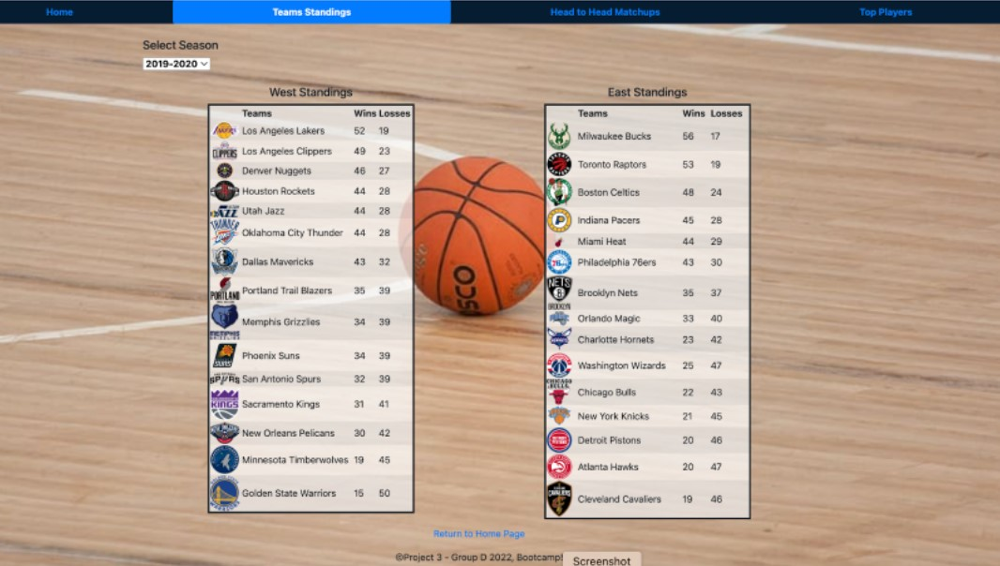
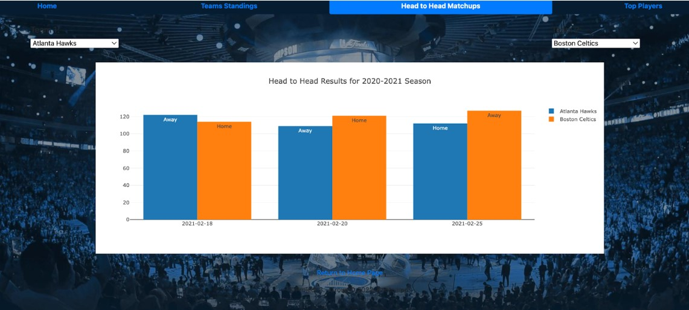
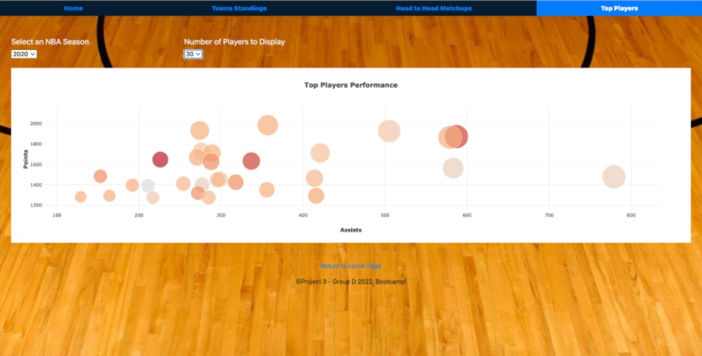

# project-3
### Overview
The objective of this project is to build interactive web visualizations powered by a dataset. Our focus is on NBA Statistics, specifically the data on individual teams, team comparisons, and individual players.

Our page allows the user an interactive way to look up and explore:
- 3 NBA seasons (2019, 2020, and 2021) team standings
- All head-to-head matchups for the 2020-2021 season
- Top player stats: points, assists, field goal accuracy, and games played for seasons 1985-2021

### Data
Data was gathered from the following sources:
- https://api-sports.io/documentation/basketball/v1 
- https://www.balldontlie.io/#get-all-stats

Using python with requests and pymongo libraries, the api's were called and the data was transfered to MongoDB. Check `APIBuilder.ipynb` and `player_stats_API.ipynb`.

### Web Visualizations
Our webpage is powered using Flask API. Our server successfully connects to MongoDB to retrieve and feed the data to power our visualizations. See `app.py`.

We used JavaScript along with the Plot.ly and D3 libraries to create our interactive charts (see `/static`). 

Part of the challenge was to also use a new JS library so we utilized [bideo.js](https://github.com/rishabhp/bideo.js) to add a background video to our homepage.

Finally, we deployed our page using herokuapp:  [NBA Stats](https://gtbootcampnbastats.herokuapp.com/)

